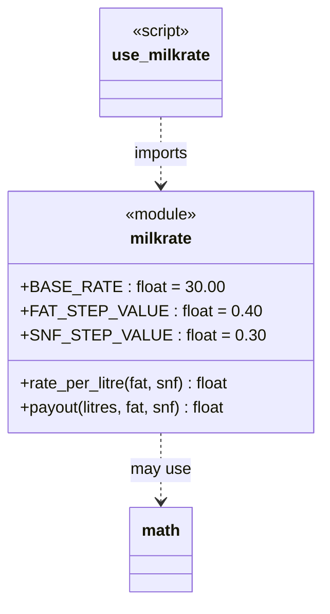

# UML - module structure (Task 7)

```mermaid
classDiagram
    class milkrate {
        <<module>>
        +BASE_RATE : float = 30.00
        +FAT_STEP_VALUE : float = 0.40
        +SNF_STEP_VALUE : float = 0.30
        +rate_per_litre(fat, snf) float
        +payout(litres, fat, snf) float
    }
    class use_milkrate {
        <<script>>
    }
    use_milkrate ..> milkrate : imports
    milkrate ..> math : may use
```
