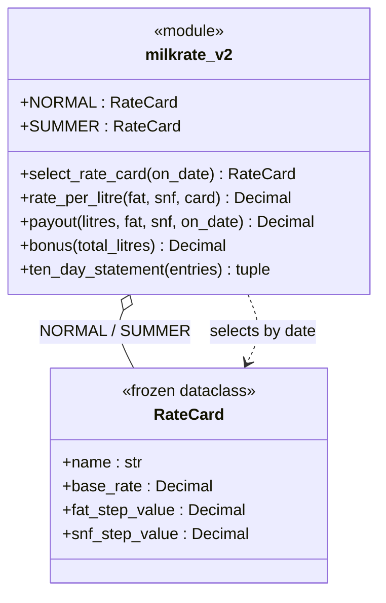

# UML - revised design (Task 12)

```mermaid
classDiagram
    class RateCard {
        <<frozen dataclass>>
        +name : str
        +base_rate : Decimal
        +fat_step_value : Decimal
        +snf_step_value : Decimal
    }
    class milkrate_v2 {
        <<module>>
        +NORMAL : RateCard
        +SUMMER : RateCard
        +select_rate_card(on_date) RateCard
        +rate_per_litre(fat, snf, card) Decimal
        +payout(litres, fat, snf, on_date) Decimal
        +bonus(total_litres) Decimal
        +ten_day_statement(entries) tuple
    }
    milkrate_v2 o-- RateCard : NORMAL / SUMMER
    milkrate_v2 ..> RateCard : selects by date
```
